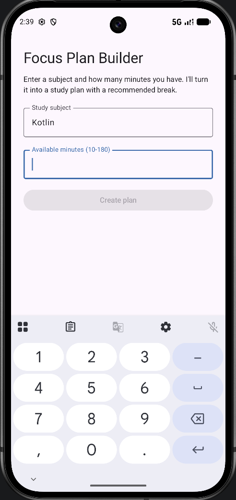

# Focus Plan Builder

**Name:** Jimmy He

**Assignment:** Focus Plan Builder

## Description

Single-screen Android app in Kotlin/Compose. Enter a subject and available minutes, then it validates input, classifies the session, recommends a break, and shows the result on a card.

## Running it

Open in Android Studio, sync Gradle, run on API 26+. Enter a subject and 10-180 minutes, tap **Create plan**.

```bash
./gradlew installDebug
./gradlew test
./gradlew connectedAndroidTest
```

## Screenshots





## State and recomposition

1. **Which composable owns the application state?** `FocusPlanRoute` owns state (`subject`, `minutesText`, `plan`) via `rememberSaveable`/`remember`; `FocusPlanScreen` is stateless, taking values as parameters and reporting actions via callbacks.

2. **Why are the text-field values stored as `String` rather than `Int`?** A field must render in-progress input like `"18a"`, which `Int` can't hold.

3. **Why is `toIntOrNull()` safer than `toInt()`?** `toIntOrNull()` returns `null` on bad input instead of throwing like `toInt()`, so `canCreatePlan` evaluates `false` instead of crashing.

4. **What state change causes the button to be recomposed?** `canCreatePlan` is `derivedStateOf` over `subject`/`minutes`; any keystroke recomposes it, and the `Button` recomposes since `enabled` reads that value, no separate boolean involved.

5. **What does `rememberSaveable` preserve that a local variable would not?** It writes to the instance-state `Bundle` and survives Activity recreation; plain `remember` doesn't. Confirmed via Logcat: a new Activity hash appears each rotation, and `subject`/`minutesText` kept their values across it.

6. **AI use:** see below.

## Generative-AI assistance statement

**Tool:** Claude Sonnet 5

**Assistance:** Explained Compose concepts (`remember` vs. `rememberSaveable`, `derivedStateOf`, state hoisting) as I built each file, and helped interpret test failures and Logcat output. Also helped with tighten sentence structure and wording.

**Verified/changed myself:** Fixed two bugs my own tests caught, a capitalization mismatch in `durationCategory`, and an ambiguous `onNodeWithText("Kotlin")` lookup matching two nodes once the card showed. Manually confirmed the numeric keyboard and walked the full test table on-device before automating it.

**Confirmed understanding:** I can explain why `FocusPlanRoute` owns state while `FocusPlanScreen` stays stateless, why validation uses `toIntOrNull()`, and why the button's state is derived, above.
