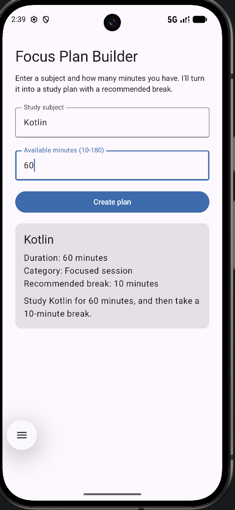

# Focus Plan Builder

**Name:** Jimmy He
**Assignment:** Focus Plan Builder (Jetpack Compose, single-screen study plan app)

## Description

A single-screen Android app built with Kotlin and Jetpack Compose (Material 3). I enter a study subject and the number of minutes I have available, and the app validates the input, classifies the session into a duration category, recommends a break length, and displays the result on a Material 3 card.

## Running it

1. Clone the repo and open the root folder in Android Studio.
2. Let Gradle sync. No API keys or external config needed.
3. Run on an emulator or device with API 26+ (`minSdk` in `app/build.gradle.kts`).
4. Enter a subject and a duration between 10 and 180 minutes, then tap **Create plan**.

From the command line:

```bash
./gradlew installDebug
```

To run tests:

```bash
./gradlew test                  # unit tests (durationCategory, recommendedBreak)
./gradlew connectedAndroidTest  # instrumented Compose UI tests (needs an emulator/device)
```

## Screenshot



## State and recomposition

**Which composable owns the application state?** `FocusPlanRoute` owns all mutable state, `subject`, `minutesText`, and `plan`, via `rememberSaveable`/`remember`. `FocusPlanScreen` is stateless: it receives everything as parameters and reports user actions through callbacks (`onSubjectChange`, `onMinutesChange`, `onCreatePlan`), so it never touches the state directly.

**Why are the text-field values stored as `String` rather than `Int`?** A `TextField`'s value must always represent exactly what's on screen, including invalid or in-progress input like `""` or `"18a"`. An `Int` can't hold those intermediate states, so the field would reject keystrokes or crash mid-typing. Storing `String` and parsing on demand keeps the field always renderable.

**Why is `toIntOrNull()` safer than `toInt()`?** `toInt()` throws `NumberFormatException` on any non-numeric string, crashing the app the moment a user types a letter or leaves the field empty. `toIntOrNull()` returns `null` instead, so invalid input flows into `canCreatePlan` evaluating to `false` rather than crashing the process.

**What state change causes the button to be recomposed?** `canCreatePlan` is a `derivedStateOf` over `subject` and `minutes`. Any keystroke that changes either one recomposes `FocusPlanRoute`, which re-evaluates `canCreatePlan`, and Compose recomposes the `Button` because its `enabled` parameter reads that value. There's no separate mutable boolean to fall out of sync.

**What does `rememberSaveable` preserve that a local variable would not?** A local variable or plain `remember` is scoped to the Composition and is lost when the `Activity` is destroyed and recreated, e.g. on rotation. `rememberSaveable` writes into the instance-state `Bundle`, so the value survives configuration changes and rehydrates on the next composition. I confirmed this directly: Logcat showed a new `Activity` instance hash on each rotation, and `subject`/`minutesText` kept their typed values across that recreation, while `plan` (plain `remember`) is not required to survive rotation per the spec.

## Generative-AI assistance statement

**Tool used:** Claude (Anthropic), used as a technical mentor and pair-programming guide, not as a code-generation shortcut.

**What assistance it provided:** Claude explained Jetpack Compose concepts (`remember` vs. `rememberSaveable`, `derivedStateOf`, state hoisting, null-safe parsing) as I built each file, walked me through what to type and why, and helped me interpret test failures, Logcat output, and emulator behavior when something didn't match expectations.

**What portions I changed or verified:** I typed every file myself rather than pasting generated code, and personally diagnosed and fixed two real bugs the test suite caught: a capitalization mismatch between `durationCategory`'s output and the spec's exact wording, and an ambiguous `onNodeWithText("Kotlin")` lookup in an instrumented test that matched two nodes once the result card was showing. I also independently confirmed the emulator's numeric keyboard was actually appearing for the minutes field (not just configured) and manually walked the full required test table on my own device before automating it.

**How I confirmed I understand the submitted code:** I can explain why each piece is structured the way it is, why `FocusPlanRoute` owns state while `FocusPlanScreen` stays stateless, why validation uses `toIntOrNull()` instead of `toInt()`, and why the button's enabled state is derived rather than a separate mutable flag, all covered in the state-and-recomposition section above. I verified rotation behavior myself with Logcat rather than taking the expected behavior on faith, and I'm responsible for the final submission.
